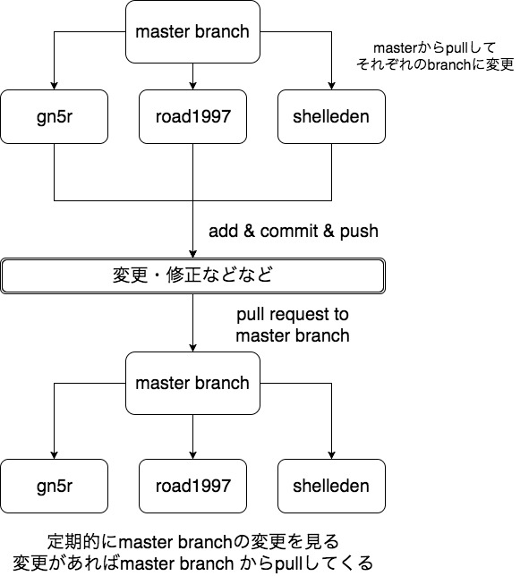

# チーム逆万枚就プレ企画

更新状況
- 2017年11月11日(土) リポジトリ構成見直し、プロジェクト統一
- 2017年11月13日(月) create magro branch & added cad directory
- 2017年11月14日(火) AndroidとArduinoのサンプルを再編成 UDP実装
- 2017年11月16日(木) AndroidSapmleにてUDP受信機能実装。IPAddressとPortの表示 
同日 UDP送受信可能に。また初回起動時にIPAddressとPortを保存可能に
- 2017年11月17日(金) ESP-WROOMディレクトリ、README作成
- 2017年11月20日(月) リストダイアログ実装。接続先を複数個へ(5つまで登録可能)

ブランチ名は各自で好きなように設定して構わないけど、３人がわかる範囲内でおねがい 
基本的に僕のブランチ名は`gn5r`です 
また、パソコンを使い分ける時があるので`shangyuan.tuolang`を使う時もあります。 
`master`ブランチはpull専用のブランチにしました。 
間違えてmasterブランチでpushしてもエラー吐きます。

## Gitの流れ

## Gitコマンド使い方(基礎部分)

### Git初期設定〜ダウンロード編

Windows環境なら**Cmder(full version)** をダウンロードしておく。 
`git --version` を打ち込み正しくgitが使えるかどうかを検証しておく。 

コマンドプロンプトを管理者権限で実行 
`cmder /REGISTER ALL`これを入力するとコンテキストメニューからCmderを実行できる 
`git config --global user.email "exsample@email.com"` 
`git config --global user.name "github user name"` 
`git config --global credential.helper store(Windows環境ならwincred)` 

上記3つのconfigを設定してgitの初期設定は完了 

初期設定が完了したらGitリポジトリ(ディレクトリ)をダウンロードするフォルダを予め作成しておく 
一例ではLinux環境なので適宜読み替えてください。 
`/home/gn5r/←カレントディレクトリ $ mkdir Test` 
カレントディレクトリを作成したフォルダへ移動 
`cd Test/` 
Gitを使うため初期化 
`git init` 
Gitリポジトリを追加しダウンロード 
`git remote add name(好きな名前。originが基本) 該当URL` 
`git pull main ダウンロードするブランチ名(基本gn5r)` 
これでmasterブランチのファイル群がダウンロードできた 

### 内容変更〜アップロード編

アップロードの前にブランチ名を新規作成してもらう必要がある 
`git checkout -b name(ここは好きな名前でおｋ)` 
これができたら、ダウンロード編でダウンロードしたファイルを変更、修正した場合は、gitへアップロード 
`git add .`　を打つことで変更した物**全て**をアップロード対象にする 
`git commit -m "change xx.txt"` ←""の中に、何を変更したか等を明記 
コミットはどこを変更、修正などをしたかのコメントと思って頂けたらいいかも 
`git push リモート名 name(さっき作成したブランチ名)` 
これで晴れてアップロードが完了する

### 変更内容を master branch に適用させる

適用させる前に、適用していいかどうかをmasterに見てもらいます。 
**issue** という課題のようなものを提示しておいたので、まずそれを参照します。 
- github web上から **Pull Rewuests** をクリック
- 画面左側にある**new pull request**を選択
- 画面中央付近に**base master ... compare:branch name**があるので自身のブランチ名を選択(規定で自身のブランチが選択されていると思う)
- 変更・修正部分を明記する(issueの番号も明記 **#1** など。また、Markdown形式なので改行など注意)
- **create pull request** をクリックしてリクエスト送信

以上を行い**リクエスト送信者以外の誰かが**許可(確認)をすると、マージ(結合)が可能となる。 

## Git&shellコマンド集

| Command Name     | 説明     |
| :------------: | :------------: |
| ls | カレントディレクトリにあるファイル一覧表示 |
| ls -a | カレントディレクトリにある隠しフォルダ含めすべて表示 |
| pwd | カレントディレクトリの表示(確認)　|
| cd | カレントディレクトリの移動 |
| cd / | rootディレクトリへ移動 |
| mkdir | 新規ディレクトリ作成 |
| touch | 新規ファイル(拡張子込)作成 |
| cp コピー対象 コピー場所 | ファイル/フォルダのコピー |

gitコマンドについては全て`git 〜`のコマンドです

| Git Command Name     | 説明     |
| :------------: | :------------: |
| init | 初期化|
| remote add name URL | リモートリポジトリ追加|
| pull name master(branch name)| マスターブランチからpull |
| checkout -b name | 新規ブランチ作成|
| add file name(拡張子付き) | アップロード対象を１ファイル(1フォルダ)に |
| add . | 全てアップロード対象 |
| commit -m "comment" | アップロード時のコメント&対象確定 |
| push name branch | リモートリポジトリへ対象をアップロード |
| status | 変更の状態を見れる(何が変更されたかなど)|
| remote -v      | リモートURLの確認 |
| remote remove name | nameで設定したURL削除 |

## UDPSample使い方

- [UDPSample使い方](./UDPSample/README.md)

なお、Cmderの使い方として**矢印⇧**で履歴が使える 
**TABキー** であらゆる候補がでる(長いブランチ名やディレクトリ名の時に一々手入力せずに済む) 
何かわからなければ僕に聞いてください.
